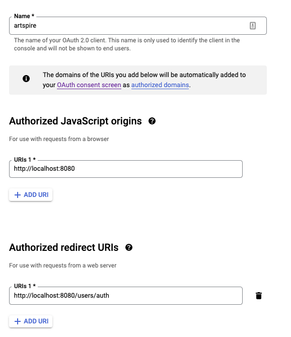

# Artspire

A web application that aims to help and inspire artists and amateur hobbyists, who want to delve into the world of creating paintings.

With Artspire, the user will be able to explore an expansive gallery of photos for inspiration, and find matching color palettes and helpful video tutorials on some useful techniques.

## Table of Contents

- [Artspire](#artspire)
  - [Table of Contents](#table-of-contents)
  - [Tech Stack](#tech-stack)
  - [Environment Variables](#environment-variables)
      - [In client folder, create a .env file and add the following variables](#in-client-folder-create-a-env-file-and-add-the-following-variables)
      - [Generate API keys to access Unsplash and Youtube APIs:](#generate-api-keys-to-access-unsplash-and-youtube-apis)
      - [In server folder, create a .env file and add the following variables](#in-server-folder-create-a-env-file-and-add-the-following-variables)
      - [Genreate OAuth Client ID and secret:](#genreate-oauth-client-id-and-secret)
  - [Development](#development)
  - [Acknowledgements](#acknowledgements)

## Tech Stack

-   Front End: React, Sass, HTML
-   Back End: Node JS, Express
-   Database: MySQL
-   Authentication: OAuth
-   External APIs: Unsplash, Youtube

## Environment Variables

To run this project, you will need to add environment variables to your .env files for client and server both.

#### In client folder, create a .env file and add the following variables

`REACT_APP_UNSPLASH_API_URL=https://api.unsplash.com`
`REACT_APP_UNSPLASH_API_KEY=XXXX`

`REACT_APP_BACKEND_API_URL=http://localhost:8080`

`REACT_APP_YOUTUBE_API_URL=https://www.googleapis.com/youtube/v3/search`
`REACT_APP_YOUTUBE_API_KEY=XXXX`

#### Generate API keys to access Unsplash and Youtube APIs:

[Unsplash](https://unsplash.com/developers) - Register as a developer and generate an API key

[Google](https://developers.google.com/youtube/v3/getting-started) - Generate the API key and enable access to Youtube API.

#### In server folder, create a .env file and add the following variables

`PORT=XXXX`

`SESSION_SECRET=XXXXXXX`

`GOOGLE_CLIENT_ID=XXXX`

`GOOGLE_CLIENT_SECRET=XXXX`

`GOOGLE_CALLBACK_URL=http://localhost:8080/users/auth`

#### Genreate OAuth Client ID and secret:

[Google](https://developers.google.com/identity/protocols/oauth2) Create a client ID and add these as settings:


Generate a secure token text and add it to the `SESSION_SECRET` variable in .env

```bash
node -e "console.log(require('crypto').randomBytes(32).toString('hex'));"
```

## Development

In client folder, run the following commands:

```bash
npm install
npm start
```

In server folder, run the following commands:

```bash
npm install
npm migrate
npm start
```

## Acknowledgements

-   [Project artwork](https://undraw.co/)
-   [Unsplash API](https://unsplash.com/developers)
-   [Google API](https://developers.google.com/youtube/v3)
